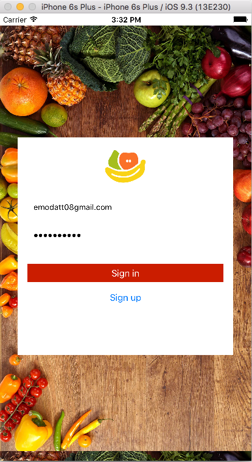
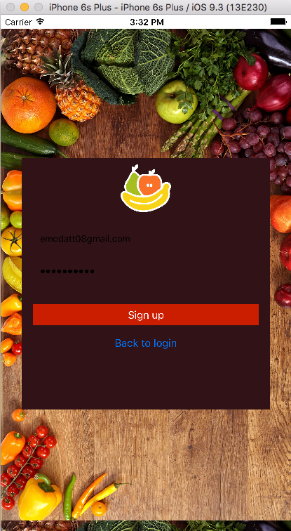
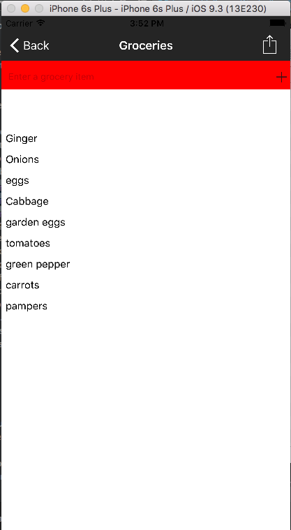

# Groceries [](https://travis-ci.org/NativeScript/sample-Groceries)

Groceries is a NativeScript Angular 2 iOS and Android app for managing grocery lists. 


<h2 id="screenshots">Screenshots</h2>






<h2 id="development">Development</h2>

This app is built with the NativeScript CLI. Once you have the [CLI installed](https://docs.nativescript.org/angular/tutorial/ng-chapter-1#11-install-nativescript-and-configure-your-environment), start by cloning the repo:

```
$ git clone https://github.com/emodatt08/Nativescript-Groceries-App.git
$ cd <project name>
```

From there you can use the `run` command to run Groceries on iOS:

```
$ tns run ios
```

And the same command to run Groceries on Android:

```
$ tns run android
```


<h3 id="unit-testing">Unit Testing</h3>

Groceries uses NativeScript’s [integrated unit test runner](http://docs.nativescript.org/core-concepts/testing) with [Jasmine](http://jasmine.github.io/). To run the tests for yourself use the `tns test` command:

```
$ tns test ios --emulator
```

```
$ tns test android --emulator
```

For more information on unit testing NativeScript apps, refer to the [NativeScript docs on the topic](http://docs.nativescript.org/core-concepts/testing).

